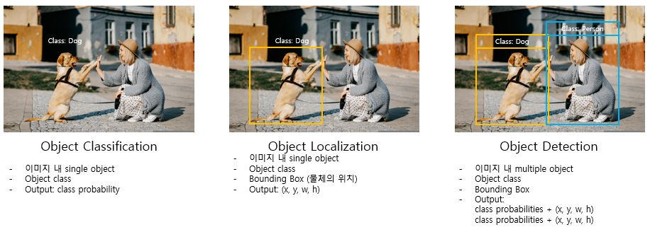
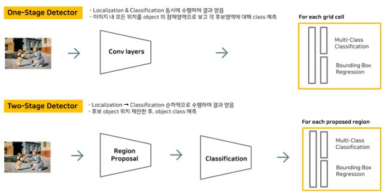

## [ Paper Review ] You Only Look Once: Unified, Real-Time Object Detection
### 1. Basic Concept: What is Objection Detection?
</img> 
* * *
### 2. One-stage detector vs. two-stage detector
</img> 
